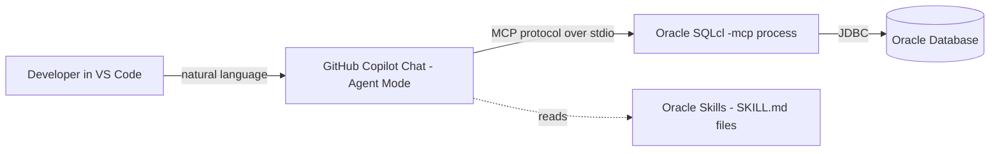

# Troubleshooting Oracle Database View Logic with GitHub Copilot + Oracle SQLcl MCP

This guide walks developers through setting up **Oracle SQLcl's built-in MCP (Model Context Protocol) server**, **GitHub Copilot in VS Code**, and **Oracle's public Copilot skills** so an AI assistant can help investigate data issues that originate in the logic of database views (incorrect joins, filters, aggregations, etc.).

---

## Table of Contents

1. [What You're Building](#what-youre-building)
2. [Prerequisites](#prerequisites)
3. [Step 1 — Install / Verify Java](#step-1--install--verify-java)
4. [Step 2 — Install Oracle SQLcl](#step-2--install-oracle-sqlcl)
5. [Step 3 — Create a Least-Privilege Database User](#step-3--create-a-least-privilege-database-user)
6. [Step 4 — Save the Database Connection in SQLcl](#step-4--save-the-database-connection-in-sqlcl)
7. [Step 5 — Configure the MCP Server in VS Code](#step-5--configure-the-mcp-server-in-vs-code)
8. [Step 6 — Install GitHub Copilot & Oracle Skills](#step-6--install-github-copilot--oracle-skills)
9. [Step 7 — Verify the Full Setup](#step-7--verify-the-full-setup)
10. [Using the Setup to Troubleshoot a View](#using-the-setup-to-troubleshoot-a-view)
11. [Security Notes](#security-notes)
12. [Troubleshooting](#troubleshooting)
13. [References](#references)

---

## What You're Building



- **GitHub Copilot** (in VS Code) is the AI assistant / chat interface.
- **Oracle SQLcl MCP server** exposes safe, tool-based access to an Oracle Database (list connections, connect, run SQL/PL-SQL, run SQLcl commands) so Copilot can query and inspect the database directly.
- **Oracle Skills** (open-source markdown "skill" files) give Copilot domain expertise on Oracle SQL, PL/SQL, performance tuning, and SQLcl usage, so it applies Oracle-specific best practices instead of generic SQL guesses.
- **Java** is required because SQLcl itself runs on the JVM.

---

## Prerequisites

| Requirement | Minimum Version | Why |
|---|---|---|
| VS Code | Latest stable | MCP client support (Agent Mode) |
| GitHub Copilot / Copilot Chat extensions | Latest | Chat + Agent Mode UI, skill discovery |
| Java (JRE) | 17 or 21 | Required to run SQLcl |
| Oracle SQLcl | 25.2 or later | MCP server was introduced in 25.2; earlier versions do not support `-mcp` |
| Oracle Database access | Any supported edition (on-prem, Autonomous, or container) | Target of the queries |
| A database account | Least-privilege, read access to the views/tables in question | See [Step 3](#step-3--create-a-least-privilege-database-user) |

You do **not** need SQL Developer, Docker, or any additional runtime — SQLcl and the JVM are the only new local dependencies.

---

## Step 1 — Install / Verify Java

SQLcl requires a JRE 17 or 21 on your PATH.

**macOS (Homebrew):**
```bash
brew install openjdk@17
```

**Verify:**
```bash
java -version
```

If you manage multiple JDKs, point SQLcl at the correct one by setting `JAVA_HOME` before launching `sql`:
```bash
export JAVA_HOME="/path/to/jdk-17"
```

---

## Step 2 — Install Oracle SQLcl

**macOS (Homebrew):**
```bash
brew install sqlcl
# or, if already installed:
brew upgrade sqlcl
```

**Manual install (macOS/Linux):**
```bash
curl -O https://download.oracle.com/otn_software/java/sqldeveloper/sqlcl-latest.zip
unzip sqlcl-latest.zip -d ~/sqlcl
export PATH="$HOME/sqlcl/sqlcl/bin:$PATH"
```

**Windows (winget):**
```powershell
winget install Oracle.SQLcl
```

**Verify the version (must be 25.2+):**
```bash
sql -V
```

**Find the absolute path to the `sql` binary** — you'll need this for the MCP config in Step 5:
```bash
which sql      # macOS/Linux
where sql      # Windows
```

---

## Step 3 — Create a Least-Privilege Database User

Do **not** point the MCP server at a DBA or schema-owner account. This step is owned by your **DBAs** — request a dedicated, read-only account that is granted `SELECT` on the specific views under investigation only (not the underlying tables, and not `SELECT ANY TABLE`):

```sql
CREATE USER copilot_ro IDENTIFIED BY "<strong-password>";
GRANT CREATE SESSION TO copilot_ro;

-- View-only access, one grant per view a developer needs to troubleshoot
GRANT SELECT ON hr.active_enrollments TO copilot_ro;
GRANT SELECT ON hr.employee_summary_v TO copilot_ro;
```

Because access is limited to the views themselves, developers can query and compare view output, but cannot read the base tables directly or use MCP to inspect the view's source (`DDL`/`dba_views`) unless the DBA separately grants that. Ask your DBA to add/remove view grants as new investigations come up, rather than widening the account's scope permanently.

---

## Step 4 — Save the Database Connection in SQLcl

The MCP server cannot accept credentials at runtime — connections must be pre-saved.

```bash
sql /nolog
```
```sql
conn -save mydb_ro -savepwd copilot_ro/"<strong-password>"@//hostname:1521/service_name
```

- `-save <name>` names the connection (referenced later by Copilot via the `connect` MCP tool).
- `-savepwd` stores the password securely in `~/.dbtools`.

For TNS-based connections, set `TNS_ADMIN` first so SQLcl can resolve the alias:
```bash
export TNS_ADMIN=/path/to/tns/directory
sql /nolog
```
```sql
conn -save mydb_ro -savepwd copilot_ro/"<strong-password>"@tns_alias
```

Confirm it saved correctly:
```sql
conn -list
```

---

## Step 5 — Configure the MCP Server in VS Code

VS Code (Agent Mode) reads MCP server definitions from a `.vscode/mcp.json` file in your workspace (or from user settings for a global config).

Create `.vscode/mcp.json` in your project:

```json
{
  "servers": {
    "sqlcl": {
      "type": "stdio",
      "command": "/absolute/path/to/sql",
      "args": ["-mcp"]
    }
  }
}
```

If you use TNS-based connections, pass `TNS_ADMIN` explicitly — spawned MCP processes do not inherit your shell environment:

```json
{
  "servers": {
    "sqlcl": {
      "type": "stdio",
      "command": "/absolute/path/to/sql",
      "args": ["-mcp"],
      "env": {
        "TNS_ADMIN": "/path/to/tns/directory"
      }
    }
  }
}
```

**Restrict levels:** `-mcp` defaults to restrict level `4` (most locked-down — blocks host commands, file I/O, script execution). For view troubleshooting (read-only investigation), the default level 4 is usually sufficient since you only need `SELECT`. Only lower it if you need Liquibase or scripting features:
```json
"args": ["-R", "3", "-mcp"]
```

After saving `mcp.json`, open the **Copilot Chat** panel in VS Code, switch to **Agent Mode**, and start (or reconnect) the `sqlcl` server from the MCP servers list (usually shown as a small server/tools icon in the chat view, or via the "MCP: List Servers" command). VS Code will spawn `sql -mcp` as a child process automatically when the server is used.

---

## Step 6 — Install GitHub Copilot & Oracle Skills

1. Install the **GitHub Copilot** and **GitHub Copilot Chat** extensions in VS Code and sign in with an account that has a Copilot license.
2. Enable **Agent Mode** in Copilot Chat (required for MCP tool calling).
3. Install the Oracle Database skills **locally on each developer's laptop** so Copilot applies Oracle-specific conventions (SQLcl usage, tuning methodology, safe DML, view/PL-SQL patterns) instead of generic SQL advice. Skills are plain markdown files with YAML frontmatter (`SKILL.md`), auto-discovered by Copilot from a local user-level skills directory — no repo checkout or org-wide install needed:
     ```bash
     git clone https://github.com/oracle/skills.git ~/oracle-skills
     mkdir -p ~/.copilot/skills
     cp -R ~/oracle-skills/db ~/.copilot/skills/db
     ```
   - Relevant sub-topics for this workflow: `db/sqlcl/` (SQLcl + MCP usage), `db/performance/` (explain plans, tuning), `db/sql-dev/` (query patterns), `db/agent/` (safe read-only workflows).
   - This is a one-time, per-laptop setup — each developer runs it individually.
4. Restart VS Code (or reload the window) so Copilot re-scans available skills and MCP servers.

---

## Step 7 — Verify the Full Setup

In Copilot Chat (Agent Mode), ask something simple to confirm the chain works end to end:

> "List my saved Oracle database connections."

Copilot should call the `list-connections` MCP tool and return `mydb_ro`. Then:

> "Connect to mydb_ro and run SELECT * FROM HR.ACTIVE_ENROLLMENTS WHERE ROWNUM <= 10."

Copilot should call `connect`, then `run-sql` and return rows from the view. Since the account only has `SELECT` on specific views, it cannot fetch the view's DDL/source or query the underlying base tables directly — see the workflow below.

---

## Using the Setup to Troubleshoot a View

Because the MCP account only has `SELECT` on views (no base tables, no `DDL`/`dba_views` access), the workflow is scoped to what can be observed through the view itself, with the DBA in the loop for anything deeper:

1. **Reproduce**: "Query view `HR.ACTIVE_ENROLLMENTS` filtered to student ID 12345 and show me the raw output."
2. **Characterize the symptom**: Ask Copilot to compare expected vs. actual rows/columns from the view alone (e.g., missing rows, duplicate rows, null values, wrong aggregation) and form a hypothesis about which part of the view's logic is likely responsible.
3. **Request the view definition from the DBA**: Since the account can't read `dba_views`/`all_views` or the base tables, ask your DBA to share the view's `CREATE VIEW` source (or temporarily grant `SELECT` on `dba_views`/`dba_source` for the investigation).
4. **Analyze with Copilot**: Paste the view definition into Copilot Chat and ask it to explain the join/filter/aggregation logic and identify likely causes for the observed symptom, using the `db/sql-dev` and `db/performance` skills for Oracle-specific reasoning.
5. **Propose a fix**: Ask Copilot to draft a corrected `CREATE OR REPLACE VIEW` statement.
6. **Hand off for execution**: The MCP account cannot run DDL against the view (it only has `SELECT`) — review the proposed fix and hand it to your DBA (or a properly privileged account) to apply and re-test.

---

## Security Notes

- Never save a DBA or schema-owner connection for MCP use — use the least-privilege account from [Step 3](#step-3--create-a-least-privilege-database-user).
- Keep restrict level at `4` (default) unless you have a specific, reviewed reason to lower it.
- `~/.dbtools` contains saved credentials — treat it like any other credential store (correct file permissions, not checked into source control).
- MCP communicates over `stdio` only (no network port), but the spawned `sql` process still has whatever database privileges the saved connection has — scope those privileges deliberately.
- Always review AI-generated DDL/DML before approving execution, especially `CREATE OR REPLACE VIEW`, `UPDATE`, and `DELETE` statements.

---

## Troubleshooting

| Symptom | Likely Cause | Fix |
|---|---|---|
| `sql -mcp` fails to start | Java not on PATH, or wrong JDK version | Verify with `java -version`; set `JAVA_HOME` |
| `-mcp` flag not recognized | SQLcl version < 25.2 | Upgrade SQLcl (`brew upgrade sqlcl`) |
| Copilot can't see the `sqlcl` MCP server | `.vscode/mcp.json` malformed, or command path wrong | Re-check JSON syntax and the absolute path from `which sql` |
| `connect` tool fails / "connection not found" | Connection wasn't saved with `-savepwd`, or wrong name | Re-run `conn -save ... -savepwd ...`; confirm with `conn -list` |
| TNS alias not resolving | `TNS_ADMIN` not passed to the spawned process | Add `"env": {"TNS_ADMIN": "..."}` in `mcp.json` |
| Copilot gives generic (non-Oracle-aware) answers | Skills not installed or not discovered | Confirm `SKILL.md` files exist under your skills folder and reload VS Code |
| Commands like `spool`, `@script.sql`, or `host` are blocked | Default restrict level 4 | Intentional for read-only troubleshooting; only lower with `-R` if truly needed |

---

## References

- Oracle SQLcl downloads: https://download.oracle.com/otn_software/java/sqldeveloper/sqlcl-latest.zip
- Oracle Skills repository: https://github.com/oracle/skills
